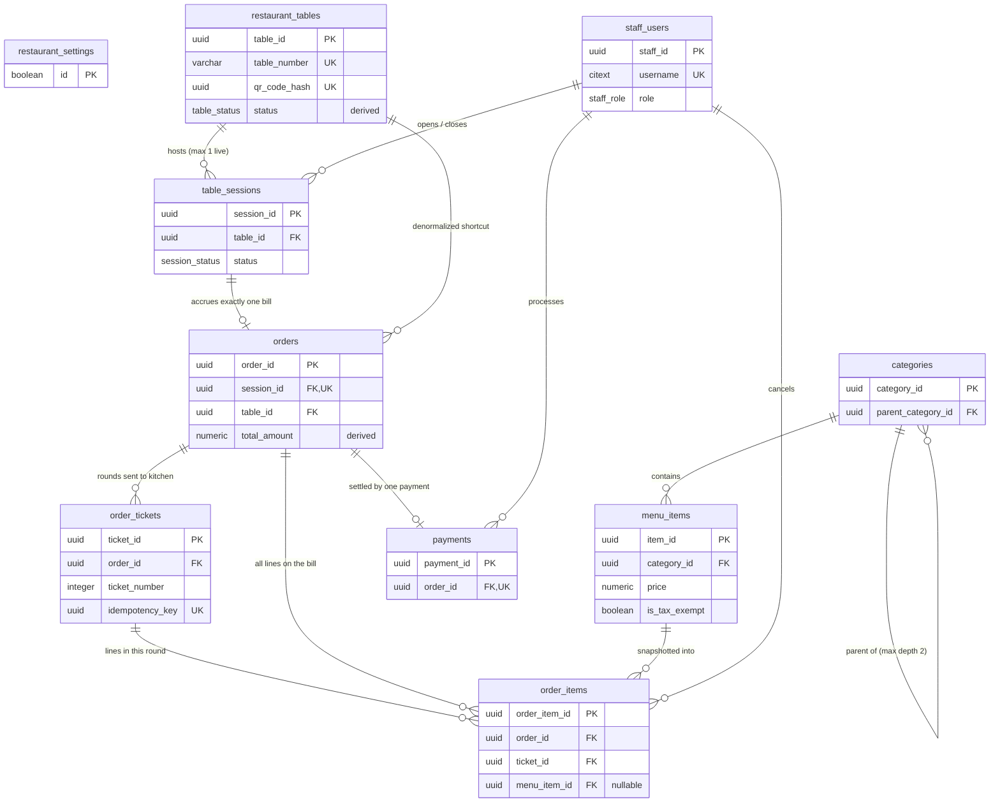
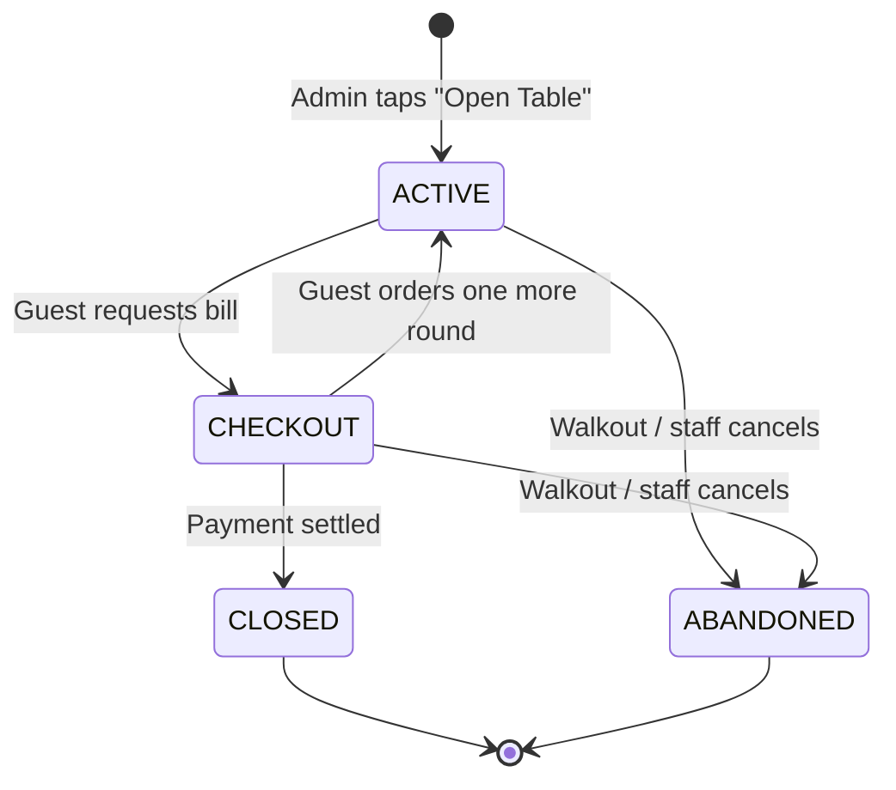

# The Everest Bistro — Database Architecture & Schema Reference

**Document version:** v5.1
**Supersedes:** Schema Documentation v4, v5
**Target platform:** PostgreSQL 15+ / Supabase
**Companion artifact:** `everest_bistro_schema_v4.sql`
**Status:** Design complete; pending pre-production sign-off (see §11)

---

## Changes in v5.1

Added §12 (Architecture Decision Records) recording two now-settled decisions: FastAPI as sole database client and real-time transport (ADR-001), and tax-inclusive consumer pricing (ADR-002). §11.1 and §11.2 are resolved accordingly, and Appendix C catalogues on-premise portability. One compliance question remains open under ADR-002 — see §11.2.

## Corrections applied in v5

The v4 document contained several inaccuracies. They are listed here so reviewers working from the older copy know what changed.

| # | v4 statement | Correction |
|---|---|---|
| 1 | "enforces strict 3rd Normal Form (3NF)" | Inaccurate. The schema is normalized for master data but **deliberately denormalized** in the financial ledger. See §1.2. |
| 2 | "12 custom functions/triggers" | There are **13 functions** and **16 triggers**. `set_updated_at()` was undocumented. |
| 3 | Session flow given as `ACTIVE → CHECKOUT → CLOSED` | Incomplete. `ABANDONED` (walkout) and `CHECKOUT → ACTIVE` (re-open for a late round) are also legal. See §7. |
| 4 | `prices_include_tax` described as a functioning flag | It is **reserved and unread**. No code consults it. See §11.2. |
| 5 | Category depth limit attributed to "UI layout breaks" | The limit derives from **FR-01** of the Master Specification (category → sub-domain). |
| 6 | Security model | **Absent from v4 entirely.** Now §8. |
| 7 | Constraints and indexes | **Absent from v4 entirely.** Now §4. |
| 8 | Billing formula | Summarized only. Now stated in full with a worked example in §6. |
| 9 | Column listings incomplete without saying so | Now complete for every table. |

---

## 1. Overview

### 1.1 Inventory

| Object | Count |
|---|---|
| Tables | 10 |
| Views | 2 |
| Enum types | 6 |
| Functions | 13 |
| Triggers | 16 |
| Explicitly declared indexes | 18 (excludes those created implicitly by `PRIMARY KEY` / `UNIQUE` constraints) |

### 1.2 Normalization posture

Master data — staff, tables, categories, menu items — is normalized to third normal form. The financial ledger is **not**, and this is intentional.

Five deliberate denormalizations exist:

| Denormalization | Justification |
|---|---|
| `orders.subtotal`, `taxable_subtotal`, `service_charge`, `tax_amount`, `total_amount` | Derived from `order_items`, but read on every keystroke of the POS cash field. Recomputing per read is unacceptable at the till. Maintained by trigger, so they cannot drift from source. |
| `order_items.item_name_snapshot`, `price_at_time`, `is_taxable_at_time` | FR-09 requires historical accuracy. A normalized join to `menu_items` would rewrite last year's revenue when a price or tax rule changes. |
| `orders.service_rate`, `tax_rate`, `service_on_exempt` | Same principle applied to fiscal parameters: a VAT change must not retroactively alter closed books. |
| `restaurant_tables.status` | Duplicates live session state, but the admin floor grid queries it constantly. Made safe by deriving it — the column is trigger-maintained and rejects direct writes (§5). |
| `order_items.line_total` | Stored generated column. Trades a few bytes for index-friendly aggregation. |

**The correct summary of this schema is:** normalized to 3NF for master data, with controlled, trigger-enforced denormalization in the financial ledger where audit immutability and point-of-sale read latency require it. Every denormalized value has a single authoritative writer, and no application code is trusted to maintain one.

### 1.3 Core design principles

1. **Business rules live in the database.** Immutability, state transitions and money arithmetic are enforced by constraints and triggers, not by application discipline. A rogue API call or a buggy migration cannot corrupt a closed bill.
2. **Historical records are append-only.** Completed orders, their line items, and all payments are frozen. Corrections are new records, never edits.
3. **Duplicated facts have exactly one writer.** Where a value is stored twice, the second copy is derived and direct writes to it raise an exception.
4. **Fail loudly.** Ambiguous states raise rather than defaulting to a plausible guess.

---

## 2. Entity Relationship Diagram



### 2.1 The three-level order chain

The least obvious structure in this schema, and the one most likely to confuse a new developer:

```
orders          — one per dining session. The running bill.
  └─ order_tickets  — one per "Confirm & Send Order" tap. A kitchen round.
       └─ order_items — the individual dishes in that round.
```

A guest who orders starters, then mains, then dessert produces **one** order, **three** tickets, and however many items. The kitchen panel's queue is a list of *tickets*; the customer's history tab and the POS bill are views over *items*.

`order_items` carries a foreign key to both `order_id` and `ticket_id`. The `order_id` is redundant — it is reachable through the ticket — but it makes the two hottest queries in the system (bill total, customer history) single-join instead of double-join, and a foreign key on each guarantees they cannot disagree.

### 2.2 Cardinality guarantees

| Relationship | Guarantee | Enforced by |
|---|---|---|
| Table → live session | At most one | `uniq_live_session_per_table` |
| Session → order | Exactly one | `uniq_order_per_session` |
| Table → active order | At most one | `uniq_active_order_per_table` |
| Order → payment | At most one | `payments.order_id UNIQUE` |
| Category → depth | Maximum two levels | `enforce_category_depth()` |

---

## 3. Table Reference

All columns are listed. Types are abbreviated: `TS` = `TIMESTAMPTZ`, `NUM(p,s)` = `NUMERIC(p,s)`.

### 3.1 `restaurant_settings`

Constrained singleton holding current fiscal policy. New orders copy these values in as a snapshot, so changing a rate here never rewrites historical records.

| Column | Type | Notes |
|---|---|---|
| `id` | `BOOLEAN` | PK, `CHECK (id)` — permits exactly one row |
| `business_timezone` | `TEXT` | Default `'Asia/Kathmandu'`. Used by both analytics views |
| `default_tax_rate` | `NUM(5,4)` | Default `0.1300` (13% VAT). `CHECK` 0–1 |
| `default_service_rate` | `NUM(5,4)` | Default `0.1000` (10%). `CHECK` 0–1 |
| `service_charge_on_exempt_items` | `BOOLEAN` | Default `true`. House policy — see §6.3 |
| `prices_include_tax` | `BOOLEAN` | **Reserved. Not read by any code.** See §11.2 |
| `updated_at` | `TS` | |

### 3.2 `staff_users`

Role-based staff authentication (FR-03). Replaces the separate `admin_users` / `kitchen_users` tables of earlier drafts.

| Column | Type | Notes |
|---|---|---|
| `staff_id` | `UUID` | PK |
| `username` | `CITEXT` | Unique, case-insensitive. `CHECK` length 3–100 |
| `password_hash` | `TEXT` | Argon2id or bcrypt |
| `role` | `staff_role` | `'ADMIN'` \| `'KITCHEN'` |
| `display_name` | `VARCHAR(100)` | |
| `is_active` | `BOOLEAN` | Soft disable; preferred over deletion |
| `last_login_at` | `TS` | |
| `created_at`, `updated_at` | `TS` | `updated_at` maintained by trigger |

### 3.3 `restaurant_tables`

Physical dining tables.

| Column | Type | Notes |
|---|---|---|
| `table_id` | `UUID` | PK |
| `table_number` | `VARCHAR(50)` | Unique. The human label ("4", "Terrace 2") |
| `qr_code_hash` | `UUID` | Unique. 128-bit CSPRNG token printed on the permanent sticker. **Bearer credential — see §8.2** |
| `status` | `table_status` | `'EMPTY'` \| `'OCCUPIED'` \| `'CHECKOUT'`. **Derived; direct writes raise** |
| `seat_capacity` | `SMALLINT` | Optional. `CHECK > 0` |
| `is_active` | `BOOLEAN` | Table removed from the floor plan |
| `created_at`, `updated_at` | `TS` | |

### 3.4 `table_sessions`

One seating event, from "Open Table" to checkout. This table is the security model: §5.2 of the Master Specification requires the server to verify a session is still live on every request, and closing a session is what revokes the customer's JWT.

Sessions are **never deleted**, only closed. That preserves the audit trail and is what guarantees the returning-customer behavior in §6.2 of the Master Specification: Monday's session row still exists with status `CLOSED`, so Monday's cookie fails validation on Friday.

| Column | Type | Notes |
|---|---|---|
| `session_id` | `UUID` | PK. Embedded as a claim in the customer's JWT cookie |
| `table_id` | `UUID` | FK → `restaurant_tables`, `ON DELETE RESTRICT` |
| `status` | `session_status` | `'ACTIVE'` \| `'CHECKOUT'` \| `'CLOSED'` \| `'ABANDONED'` |
| `opened_by` | `UUID` | FK → `staff_users`, `ON DELETE SET NULL` |
| `closed_by` | `UUID` | FK → `staff_users`, `ON DELETE SET NULL` |
| `opened_at` | `TS` | |
| `closed_at` | `TS` | NULL while live |
| `device_count` | `SMALLINT` | FR-11 telemetry: devices joined to a shared table |

### 3.5 `categories`

Two-level menu hierarchy (FR-01). `ON DELETE RESTRICT` prevents a single deletion from cascading through sub-categories and their items.

| Column | Type | Notes |
|---|---|---|
| `category_id` | `UUID` | PK |
| `parent_category_id` | `UUID` | Self-FK, `ON DELETE RESTRICT`. NULL = top level |
| `name` | `VARCHAR(100)` | Unique per parent, case-insensitive, among non-archived rows |
| `sort_order` | `INTEGER` | |
| `is_visible` | `BOOLEAN` | |
| `archived_at` | `TS` | Soft delete |
| `created_at`, `updated_at` | `TS` | |

### 3.6 `menu_items`

Master catalog. Holds **current** price and tax rules; historical orders read their own snapshots and never join here for money.

| Column | Type | Notes |
|---|---|---|
| `item_id` | `UUID` | PK |
| `category_id` | `UUID` | FK → `categories`, `ON DELETE RESTRICT` |
| `name` | `VARCHAR(200)` | |
| `description` | `TEXT` | |
| `price` | `NUM(10,2)` | `CHECK >= 0` |
| `image_url` | `TEXT` | NULL → frontend renders the branded placeholder (FR-02) |
| `is_visible` | `BOOLEAN` | |
| `is_out_of_stock` | `BOOLEAN` | FR-04. Toggled by kitchen or admin |
| `is_tax_exempt` | `BOOLEAN` | Current tax status only |
| `sort_order` | `INTEGER` | |
| `archived_at` | `TS` | Soft delete — preserves analytics linkage from past orders |
| `created_at`, `updated_at` | `TS` | |

### 3.7 `orders`

The financial ledger for one session. Every money column below `discount_amount` is derived; see §6.

| Column | Type | Notes |
|---|---|---|
| `order_id` | `UUID` | PK |
| `session_id` | `UUID` | FK → `table_sessions`, **unique** |
| `table_id` | `UUID` | FK → `restaurant_tables`. Denormalized for the floor grid |
| `status` | `order_status` | `'ACTIVE'` \| `'COMPLETED'` \| `'VOID'` |
| `subtotal` | `NUM(10,2)` | Derived. Gross of non-cancelled lines |
| `taxable_subtotal` | `NUM(10,2)` | Derived. Portion of the above that was taxable at order time |
| `discount_amount` | `NUM(10,2)` | Manual. Requires `discount_reason` |
| `discount_reason` | `TEXT` | |
| `service_rate` | `NUM(5,4)` | **Snapshot** of policy at order creation |
| `service_on_exempt` | `BOOLEAN` | **Snapshot** of policy at order creation |
| `service_charge` | `NUM(10,2)` | Derived |
| `tax_rate` | `NUM(5,4)` | **Snapshot** of policy at order creation |
| `tax_amount` | `NUM(10,2)` | Derived |
| `total_amount` | `NUM(10,2)` | Derived. The amount owed |
| `void_reason` | `TEXT` | Required when status is `VOID` |
| `created_at` | `TS` | |
| `completed_at` | `TS` | Set iff status is `COMPLETED` |

> The three snapshot columns (`service_rate`, `tax_rate`, `service_on_exempt`) are the actual mechanism behind this schema's historical-accuracy guarantee. They were omitted from the v4 document, which then credited that guarantee to `restaurant_settings` — the opposite of how it works.

### 3.8 `order_tickets`

One row per "Confirm & Send Order" tap. A kitchen round.

| Column | Type | Notes |
|---|---|---|
| `ticket_id` | `UUID` | PK |
| `order_id` | `UUID` | FK → `orders`, `ON DELETE CASCADE` |
| `ticket_number` | `INTEGER` | 1, 2, 3… within the order. **Assigned by trigger, never by the application** |
| `idempotency_key` | `UUID` | Client-generated per submit tap. Globally unique |
| `submitted_at` | `TS` | Kitchen queue sort key |
| `acknowledged_at` | `TS` | Set when kitchen opens the ticket. NULL = still queued |

### 3.9 `order_items`

Line items with immutable purchase-time snapshots (FR-09).

| Column | Type | Notes |
|---|---|---|
| `order_item_id` | `UUID` | PK |
| `order_id` | `UUID` | FK → `orders`, `ON DELETE CASCADE` |
| `ticket_id` | `UUID` | FK → `order_tickets`, `ON DELETE CASCADE` |
| `menu_item_id` | `UUID` | FK → `menu_items`, `ON DELETE SET NULL`. Nullable by design |
| `item_name_snapshot` | `VARCHAR(200)` | Survives menu item deletion |
| `quantity` | `INTEGER` | `CHECK > 0` |
| `price_at_time` | `NUM(10,2)` | `CHECK >= 0` |
| `is_taxable_at_time` | `BOOLEAN` | Snapshot. Auto-filled from `menu_items` if the API omits it |
| `line_total` | `NUM(10,2)` | Generated stored: `price_at_time * quantity` |
| `item_status` | `order_item_status` | `'PENDING'` \| `'DELIVERED'` \| `'CANCELLED'` |
| `delivered_at` | `TS` | Set iff status is `DELIVERED`. Enables kitchen timing metrics |
| `cancelled_by` | `UUID` | FK → `staff_users`. FR-05 audit trail |
| `cancel_reason` | `TEXT` | |
| `created_at` | `TS` | |

### 3.10 `payments`

Settlement ledger. Strictly append-only.

| Column | Type | Notes |
|---|---|---|
| `payment_id` | `UUID` | PK |
| `order_id` | `UUID` | FK → `orders`, **unique**, `ON DELETE RESTRICT` |
| `method` | `payment_method` | `'CASH'` \| `'CARD'` \| `'DIGITAL'` \| `'OTHER'` |
| `total_due` | `NUM(10,2)` | Must equal `orders.total_amount` at insert time |
| `amount_tendered` | `NUM(10,2)` | Must be ≥ `total_due` |
| `change_given` | `NUM(10,2)` | Generated stored: `amount_tendered - total_due` |
| `reference_no` | `TEXT` | Required for `CARD` and `DIGITAL` |
| `processed_by` | `UUID` | FK → `staff_users` |
| `processed_at` | `TS` | |

> **Fully comped meals.** A 100% discount produces `total_amount = 0.00`, and a legitimate payment row of `0.00` with method `OTHER`. Every constraint permits this. The POS interface must therefore allow submitting a zero-value checkout — otherwise a comped table can never be closed.

---

## 4. Constraints & Indexes

The constraints *are* the business rules. This section was absent from v4.

### 4.1 Rule-bearing CHECK constraints

| Constraint | Table | Rule enforced |
|---|---|---|
| `closed_sessions_have_timestamp` | `table_sessions` | Closed/abandoned sessions have a `closed_at`; live ones do not |
| `closed_after_opened` | `table_sessions` | No negative-duration sessions |
| `no_self_parent` | `categories` | A category cannot parent itself |
| `taxable_within_subtotal` | `orders` | Taxable portion cannot exceed the gross |
| `discount_not_exceeding_subtotal` | `orders` | No negative bills |
| `discount_requires_reason` | `orders` | Every discount is justified in writing |
| `completed_orders_have_timestamp` | `orders` | Completion time exists iff completed |
| `void_requires_reason` | `orders` | Every write-off is justified |
| `delivered_items_have_timestamp` | `order_items` | Delivery time exists iff delivered |
| `sufficient_payment` | `payments` | Tendered ≥ due (Master Spec §10.1 validation rule) |
| `exact_tender_for_non_cash` | `payments` | Card and digital settle exactly; only cash makes change |
| `reference_for_digital` | `payments` | Card/digital payments carry a transaction reference |

### 4.2 Unique indexes that enforce invariants

| Index | Guarantee |
|---|---|
| `uniq_live_session_per_table` (partial: `ACTIVE`, `CHECKOUT`) | A table cannot be double-seated. This is what makes repeated QR scans safe (Master Spec edge case 4) |
| `uniq_order_per_session` | One bill per seating |
| `uniq_active_order_per_table` (partial: `ACTIVE`) | One live bill per table |
| `uniq_idempotency_key` | Duplicate submits from a flaky connection are rejected by the database, not merely by application logic (edge case 3) |
| `uniq_category_name_per_parent` (partial: non-archived) | No two sibling categories share a name |
| `uniq_ticket_number_per_order` | Ticket numbering is gapless and collision-free |

### 4.3 Performance indexes

| Index | Serves |
|---|---|
| `idx_staff_users_role` (partial: active) | Login role lookup |
| `idx_sessions_table_opened` | Session history per table |
| `idx_sessions_status` (partial: not closed) | Live floor state |
| `idx_menu_items_category_sorted` (partial: visible, non-archived) | The customer menu render — covers the sort |
| `idx_orders_completed_at` (partial: completed) | FR-08 daily revenue. The hottest analytics path |
| `idx_orders_table_status` | Admin floor grid |
| `idx_tickets_queue` (partial: unacknowledged) | The kitchen queue |
| `idx_order_items_order` / `_ticket` / `_menu_item` | Bill assembly, ticket render, item sales reports |
| `idx_order_items_pending` (partial) | Customer "Pending Preparation" list |
| `idx_order_items_taxable` (partial) | Taxable subtotal aggregation |
| `idx_payments_processed_at` | Till reconciliation |

---

## 5. Functions & Triggers

**13 functions, 16 triggers.**

### 5.1 Utility

| Function | Triggers | Purpose |
|---|---|---|
| `set_updated_at()` | `trg_staff_users_updated`, `trg_restaurant_tables_updated`, `trg_categories_updated`, `trg_menu_items_updated` | Maintains `updated_at`. *Undocumented in v4.* |

### 5.2 State machine

| Function | Trigger | Purpose |
|---|---|---|
| `enforce_derived_table_status()` | `trg_enforce_derived_table_status` (BEFORE UPDATE OF status) | Rejects any direct write to `restaurant_tables.status`. Detects legitimate writes via `pg_trigger_depth() >= 2`, meaning the write originated from `sync_table_status()`. Forces all state change through the session lifecycle |
| `enforce_session_transition()` | `trg_enforce_session_transition` (BEFORE UPDATE) | Rejects illegal transitions. See §7 for the legal set |
| `sync_table_status()` | `trg_sync_table_status` (AFTER INSERT/UPDATE OF status) | Propagates session state onto the physical table: `ACTIVE`→`OCCUPIED`, `CHECKOUT`→`CHECKOUT`, otherwise `EMPTY` |

### 5.3 Catalog

| Function | Trigger | Purpose |
|---|---|---|
| `enforce_category_depth()` | `trg_category_depth` (BEFORE INSERT/UPDATE) | Rejects a category whose parent already has a parent, capping the hierarchy at two levels per **FR-01**. *v4 attributed this to UI layout concerns; the actual driver is the specified category/sub-domain model.* |

### 5.4 Financial engine

| Function | Trigger | Purpose |
|---|---|---|
| `recalc_order_subtotals()` | `trg_recalc_order_subtotals` (AFTER INSERT/UPDATE/DELETE on `order_items`) | Recomputes `subtotal` and `taxable_subtotal` from non-cancelled lines and pushes both to the parent order. Writes nothing else |
| `recalc_order_money()` | `trg_recalc_order_money` (BEFORE INSERT/UPDATE of the six input columns on `orders`) | Derives service charge, tax and total. BEFORE-trigger touching only `NEW`, so it cannot recurse with the subtotal trigger. Full arithmetic in §6 |
| `snapshot_item_tax_status()` | `trg_snapshot_item_tax_status` (BEFORE INSERT on `order_items`) | Fills `is_taxable_at_time` from `menu_items` when the API omits it. Raises for ad-hoc lines with no `menu_item_id`, since the tax status of an off-menu item cannot be inferred |
| `assert_payment_matches_order()` | `trg_assert_payment_matches_order` (BEFORE INSERT on `payments`) | Rejects a payment whose `total_due` differs from the order's `total_amount` at settlement time |

### 5.5 Immutability

| Function | Trigger | Purpose |
|---|---|---|
| `lock_finalised_orders()` | `trg_lock_finalised_orders` (BEFORE UPDATE/DELETE on `orders`) | Only `ACTIVE` orders may be modified. Permits the `ACTIVE → COMPLETED/VOID` transition itself, nothing after |
| `lock_items_on_finalised_orders()` | `trg_lock_items_on_finalised_orders` (BEFORE INSERT/UPDATE/DELETE on `order_items`) | Blocks line-item mutation on a finalized bill. Returns `COALESCE(NEW, OLD)` — on a BEFORE DELETE, `NEW` is NULL, and returning NULL would *silently cancel* legitimate deletes instead of permitting them |
| `block_payment_mutation()` | `trg_block_payment_mutation` (BEFORE UPDATE/DELETE on `payments`) | Payments are append-only. Corrections are reversals |

### 5.6 Concurrency

| Function | Trigger | Purpose |
|---|---|---|
| `assign_ticket_number()` | `trg_assign_ticket_number` (BEFORE INSERT on `order_tickets`) | Takes `SELECT … FOR UPDATE` on the parent order row, then computes `MAX(ticket_number) + 1`. Concurrent submits from multiple devices at one table (FR-11) serialize at the lock rather than colliding on the unique constraint. Also rejects tickets against non-active orders |

> **Note on `is_taxable_at_time`.** The column is `NOT NULL` with no default, yet a BEFORE INSERT trigger populates it. This is valid: PostgreSQL validates `NOT NULL` *after* BEFORE-triggers run. The API may omit the column and receive the correct snapshot automatically, or supply it explicitly and be respected.

---

## 6. Financial Calculation Reference

This section supersedes §10.1 of the Master System Specification, whose formula (`Total = Σ(price × qty)`) accounts for neither tax, service charge, discounts, nor tax-exempt goods.

### 6.1 The arithmetic

Given an order with a taxable/exempt split and an optional whole-bill discount:

```
net_subtotal     = subtotal − discount_amount

taxable_discount = discount_amount × (taxable_subtotal ÷ subtotal)      [0 if subtotal = 0]
net_taxable      = taxable_subtotal − taxable_discount

service_base     = net_subtotal   if service_on_exempt = true
                   net_taxable    if service_on_exempt = false
service_charge   = round(service_base × service_rate, 2)

tax_amount       = round((net_taxable + service_charge) × tax_rate, 2)

total_amount     = net_subtotal + service_charge + tax_amount
```

**The discount must be prorated before either base is used.** A discount applied to a bill containing exempt goods otherwise shifts the VAT — this is the step most commonly omitted, and it silently produces a wrong tax figure rather than an error.

The proration is computed at four decimal places and only the final charge is rounded to two, so the split does not drift on large bills. The zero-subtotal guard matters because every order is empty for the interval between "Open Table" and the first ticket.

### 6.2 Worked example

Order at Table 4:

| Line | Qty | Unit | Line total | Taxable? |
|---|---|---|---|---|
| Chicken Momo | 2 | 350.00 | 700.00 | Yes |
| Bottled Water | 1 | 100.00 | 100.00 | No (exempt) |

A 10% goodwill discount of 80.00 is applied (reason: "delayed service"). Rates: service 10%, VAT 13%, `service_on_exempt = true`.

```
subtotal          = 800.00
taxable_subtotal  = 700.00
discount_amount   =  80.00

net_subtotal      = 800.00 − 80.00            = 720.00
taxable_discount  =  80.00 × (700 ÷ 800)      =  70.00
net_taxable       = 700.00 − 70.00            = 630.00

service_base      = 720.00        (policy: applies to exempt)
service_charge    = 720.00 × 0.10             =  72.00

tax_amount        = (630.00 + 72.00) × 0.13   =  91.26
total_amount      = 720.00 + 72.00 + 91.26    = 883.26
```

Guest tenders 900.00 cash → `change_given = 16.74`.

**Contrast, with `service_on_exempt = false`:**

```
service_base      = 630.00
service_charge    =  63.00
tax_amount        = (630.00 + 63.00) × 0.13   =  90.09
total_amount      = 720.00 + 63.00 + 90.09    = 873.09
```

A difference of 10.17 on an 800-rupee cover. This is why the policy is a stored, snapshotted setting rather than a hardcoded assumption.

### 6.3 Two judgment calls requiring accountant sign-off

1. **Does the service charge apply to tax-exempt goods?** Configurable via `service_charge_on_exempt_items`, snapshotted per order as `service_on_exempt`. Currently defaults to `true`.
2. **Is the service charge itself taxable in full?** The implementation says **yes**, including the portion levied on exempt goods, on the reasoning that a service charge is a supply of *service* rather than of the exempt good. If your accountant disagrees, prorate it by `net_taxable ÷ net_subtotal` — a one-line change inside `recalc_order_money()`.

Both are documented here rather than buried in the trigger because they are the two figures a tax audit will question.

---

## 7. Session State Machine

The v4 document described this as `ACTIVE → CHECKOUT → CLOSED`. That omits two legal transitions, one of which is the walkout path required by edge case 2 of the Master Specification.



### 7.1 Legal transitions

| From | To | Trigger |
|---|---|---|
| — | `ACTIVE` | Admin opens the table |
| `ACTIVE` | `CHECKOUT` | Guest requests the bill; new orders lock |
| `ACTIVE` | `ABANDONED` | Walkout or staff cancellation |
| `CHECKOUT` | `ACTIVE` | Guest orders again after asking for the bill |
| `CHECKOUT` | `CLOSED` | Payment settled |
| `CHECKOUT` | `ABANDONED` | Walkout after the bill was drawn |

Everything else raises. `CLOSED` and `ABANDONED` are terminal — a closed session can never be resurrected, which is precisely the guarantee the returning-customer scenario depends on.

### 7.2 Resulting table color

| Session status | `restaurant_tables.status` | Admin grid |
|---|---|---|
| `ACTIVE` | `OCCUPIED` | Red |
| `CHECKOUT` | `CHECKOUT` | Yellow |
| `CLOSED` / `ABANDONED` / none | `EMPTY` | Green |

### 7.3 Implementation consequence

Because table status is derived, **the "Open Table" handler must not write to `restaurant_tables` at all.** It inserts a `table_sessions` row; the status follows automatically. Any code that attempts `UPDATE restaurant_tables SET status = …` will raise. This is intended, and will surface as errors on first run against code written for earlier drafts.

---

## 8. Security Model

Absent entirely from v4. Given that §5.1 of the Master Specification is largely about IDOR prevention, this is the section a security reviewer will read first.

### 8.1 Architecture assumption

The current design assumes **FastAPI is the sole database client**, holding the Supabase `service_role` key. Under that assumption, RLS is bypassed and the real access control lives in the API layer.

> **Decided (ADR-001, §12.1).** FastAPI is the sole database client. The frontend never receives a Supabase key of any kind, and all real-time dispatch runs over FastAPI WebSockets rather than Supabase Realtime. The RLS configuration below is therefore defence-in-depth, not the primary perimeter — but it is what contains the blast radius if a key is ever mishandled.

### 8.2 The QR hash is a bearer credential

`restaurant_tables.qr_code_hash` is a 128-bit CSPRNG value bound to a physical table. Anyone holding it can initiate a session handshake for that table. It must be treated as a secret:

- Never expose the column to the `anon` or `authenticated` roles.
- Never return it in an API response other than during QR sticker generation.
- Never log it.
- Brute force is infeasible by construction (2¹²⁸ keyspace), which is the entire mitigation for the table-hijacking vulnerability described in §1.2 of the Master Specification.

### 8.3 Row Level Security

RLS is enabled on all ten tables with **zero permissive policies**, which is a deny-all default for the `anon` and `authenticated` roles.

`FORCE ROW LEVEL SECURITY` is additionally applied to `restaurant_tables`, `payments` and `staff_users`, so RLS binds even the table owner — a mistake in a migration script or an interactive `psql` session cannot read around it.

Explicit `REVOKE ALL … FROM anon, authenticated` is applied to the same three tables as belt-and-braces.

**If direct client access is later introduced,** the only tables that should receive a permissive read policy are `menu_items` and `categories`:

```sql
CREATE POLICY anon_read_menu ON menu_items
    FOR SELECT TO anon
    USING (is_visible AND archived_at IS NULL);
```

No policy should ever expose `restaurant_tables`, `payments`, `staff_users`, or live `orders`.

### 8.4 Session security chain

1. Guest scans the permanent sticker → static `qr_code_hash`.
2. Server resolves the hash to a table and checks for a live session.
3. Server issues an `HttpOnly`, `SameSite=Strict` JWT carrying the `session_id` claim.
4. Every subsequent request re-validates that the session is still `ACTIVE` or `CHECKOUT` in the database — token possession alone is never sufficient.
5. Checkout sets the session to `CLOSED`, and every JWT bearing that claim is dead from that moment.

Step 4 is the load-bearing one. The JWT is a pointer to server state, not an authority in itself.

---

## 9. Analytics Views

### 9.1 `daily_sales`

Completed orders aggregated by local business date. Cross-joins the singleton `restaurant_settings` to obtain the timezone rather than hardcoding it, so the view follows the restaurant's configuration.

Columns: `business_date`, `orders_completed`, `gross_item_sales`, `taxable_sales`, `exempt_sales`, `total_discounts`, `total_service_charge`, `total_tax_collected`, `gross_revenue`, `average_ticket`.

Aggregating on raw UTC would misattribute late-night covers to the following calendar day — a real problem for a kitchen serving past midnight.

### 9.2 `daily_writeoffs`

Voided and walked-out orders, tracked separately so they neither inflate revenue nor silently vanish from reporting (Master Spec edge case 2).

Columns: `business_date`, `voided_orders`, `value_written_off`.

> **This view aggregates on `created_at`, not `completed_at`,** because a voided order never receives a completion timestamp — `completed_orders_have_timestamp` forbids it. This is deliberate. It should not be "corrected" to match `daily_sales`.

---

## 10. Performance Notes

The Master Specification commits to 500 concurrent connections during peak service. Three things bear on that:

1. **`assign_ticket_number()` holds a row lock on the hot path.** Every order submission takes `FOR UPDATE` on its parent order row. Contention is scoped to a single table's diners, so it should be negligible — but this is the first place lock waits will appear under load, and it is the specific thing to watch in a load test.
2. **Connection pooling is mandatory.** Supabase's pgBouncer sits in front of Postgres; FastAPI must not open a connection per request.
3. **Partial indexes carry the hot queries.** The menu render, kitchen queue, pending-items list and daily revenue query each have a matching partial index, keeping them small and cache-resident.

---

## 11. Open Items & Known Limitations

### 11.1 Resolved: direct client database access

**Decided.** FastAPI is the sole database client; the frontend receives no Supabase key. See ADR-001 (§12.1).

### 11.2 Resolved with a caveat: tax-inclusive pricing

**Decided.** Menu prices are presented to the guest as fully inclusive — the displayed price is the price paid. Implemented by setting `default_tax_rate` and `default_service_rate` to `0.0000`, so the existing calculation adds nothing. See ADR-002 (§12.2).

**Outstanding caveat — the ledger will record zero VAT.** With the rates at zero, `orders.tax_amount` is `0.00` on every bill and `daily_sales.total_tax_collected` sums to zero, even though the price the guest paid embeds tax in economic terms. If the business is VAT-registered, this is a reporting problem rather than a pricing one: the system cannot produce the VAT breakdown a tax invoice requires. §12.2 sets out the two ways to resolve it and the condition under which the current approach is fine as-is. This must be confirmed with the restaurant's accountant before go-live.

`restaurant_settings.prices_include_tax` remains **reserved and unread** under the chosen approach. It becomes live only if Option B in §12.2 is adopted.

### 11.3 Not yet done: pre-production validation

The design is complete; validation is not. Three things should happen before sign-off, none of which are schema changes:

- **Load test** at the 500-connection NFR with the ticket-numbering lock in play.
- **Backup and point-in-time-restore drill.** The immutability triggers mean a bad data day cannot be repaired by editing rows — restore is the only remedy, so it must be proven to work.
- **Reconciliation run** over a day of seeded data, summing `payments` against `daily_sales` to demonstrate they agree.

### 11.4 Scope boundaries

Deliberately out of scope in this version: multi-location support (schema is single-restaurant), split billing across guests at one table, partial payments, refunds and reversals (the payments table is append-only but no reversal record type exists yet), and inventory/ingredient tracking beyond the binary `is_out_of_stock` toggle.

---

## 12. Architecture Decision Records

Decisions recorded here are settled. Each states the choice, the reasoning, what it costs, and what would justify revisiting it.

### 12.1 ADR-001 — FastAPI owns all business logic and real-time transport

**Status:** Accepted
**Decision:** All database access and all real-time dispatch route through FastAPI. Supabase is used as managed PostgreSQL and object storage only. Supabase Realtime is not used. The browser never holds a Supabase key.

**Rationale**

1. **Cost control.** Real-time socket connections on managed platforms are billed by concurrency. Holding the socket layer in Python keeps that cost at zero beyond the server the application already runs on, and makes capacity a function of hardware rather than a pricing tier.
2. **Vendor independence and on-premise migration.** This is the decisive factor. Because no business logic lives in platform-specific features, the entire system can move to a PostgreSQL instance running inside the restaurant if internet reliability becomes a problem. For a single-site restaurant whose service degrades to zero during an outage, the ability to fall back to a LAN-hosted deployment is an operational safeguard, not a theoretical one.
3. **Single enforcement point.** One codebase decides who may read what, rather than that logic being split between API handlers and RLS policies that must be kept in agreement.

**Costs accepted**

- Reconnection, backpressure, heartbeat and fan-out are now the team's problem rather than the platform's. Budget real time for the WebSocket layer.
- Horizontal scaling of FastAPI requires a shared broadcast channel (Redis pub/sub or Postgres `LISTEN/NOTIFY`) so a kitchen tablet connected to instance A receives an order submitted through instance B. Single-instance deployment does not need this; the moment a second instance exists, it does. **Design for this now even if you deploy one instance.**
- Supabase Realtime's automatic reconnect-and-replay is forfeited. A kitchen tablet that drops its socket must re-fetch the open ticket queue on reconnect rather than assuming it missed nothing — `idx_tickets_queue` exists for exactly this query.

**Portability consequences** are catalogued in Appendix C.

**Revisit if:** the deployment becomes multi-tenant across several restaurants, where per-tenant isolation via RLS starts to earn its complexity.

### 12.2 ADR-002 — Tax-inclusive pricing, flexible ledger

**Status:** Accepted, with an open compliance question

**Decision:** Guests see one price and pay exactly that price. Nepali consumer expectation is that a Rs. 1,000 dish and a Rs. 3,000 dish produce a Rs. 4,000 bill with nothing added at checkout. The owner enters the final price they intend to charge; the interface states plainly that prices include all taxes and charges.

Implemented by setting `default_tax_rate = 0.0000` and `default_service_rate = 0.0000`. The calculation in §6 still runs, adds zero, and outputs the menu price unchanged.

**Why keep the arithmetic instead of deleting it**

The hierarchical calculation is retained deliberately. Selling this system to a hotel, a bar, or a business that must itemize tax on receipts becomes a settings change rather than a schema migration and a rewritten financial engine. The cost of retaining it is a few unused columns; the cost of removing and later re-adding it is a data migration across live financial records.

**The open question: zero-rating versus tax extraction**

Zero rates achieve the pricing goal but make one specific claim in the database untrue — that no tax was collected.

| | Option A: zero rates *(current)* | Option B: implement `prices_include_tax` |
|---|---|---|
| Guest-facing price | Flat, inclusive | Flat, inclusive — **identical** |
| `orders.tax_amount` | `0.00` | The VAT embedded in the price |
| `daily_sales.total_tax_collected` | Always zero | Correct VAT total |
| Can produce a VAT invoice | No | Yes |
| Work required | None | ~15 lines in `recalc_order_money()` |

Both give the guest the same number. They differ only in whether the books know what portion of it was tax.

**Which is correct depends on VAT registration status:**

- **Not VAT-registered** (below the registration threshold, or on a turnover-based small-taxpayer regime): Option A is genuinely fine. There is no VAT to itemize, `tax_amount = 0.00` is accurate, and nothing further is needed.
- **VAT-registered:** Option A will not satisfy the reporting obligation. A registered vendor must be able to show the tax component of sales, and this system would report zero on every bill. Option B is required.

I am not a tax advisor and this is not tax advice — the registration status and its filing consequences must be confirmed with the restaurant's accountant. But the technical fork is clear, and it is cheap to take Option B now and expensive to reconstruct historical tax figures later, because closed orders are immutable by design and cannot be recalculated after the fact.

**Option B implementation sketch.** Where the exclusive path computes `price × (1 + service) × (1 + tax)`, the inclusive path inverts it:

```sql
-- Inside recalc_order_money(), when prices_include_tax = true:
--   The menu price already contains both charges, so derive backwards.
--
--   base           = net_taxable / ((1 + service_rate) * (1 + tax_rate))
--   service_charge = round(base * service_rate, 2)
--   tax_amount     = round((base + service_charge) * tax_rate, 2)
--   total_amount   = net_subtotal          -- unchanged; the guest pays the sticker price
```

The guest-facing total is untouched. Only the breakdown becomes real. The `prices_include_tax` flag, currently reserved, is what selects between the two paths.

**Revisit if:** the business registers for VAT, or the software is sold to a business that itemizes tax.

---

## Appendix A — Enum Reference

| Type | Values |
|---|---|
| `staff_role` | `ADMIN`, `KITCHEN` |
| `table_status` | `EMPTY`, `OCCUPIED`, `CHECKOUT` |
| `session_status` | `ACTIVE`, `CHECKOUT`, `CLOSED`, `ABANDONED` |
| `order_status` | `ACTIVE`, `COMPLETED`, `VOID` |
| `order_item_status` | `PENDING`, `DELIVERED`, `CANCELLED` |
| `payment_method` | `CASH`, `CARD`, `DIGITAL`, `OTHER` |

Adding a value to any of these requires `ALTER TYPE … ADD VALUE`, which cannot run inside a transaction block in older PostgreSQL versions. If a status set is expected to churn during development, `VARCHAR + CHECK` is the more flexible alternative.

## Appendix B — Requirements Traceability

| Requirement | Implementation |
|---|---|
| FR-01 Dynamic catalog | `categories` self-hierarchy + `enforce_category_depth()` |
| FR-02 Item management | `menu_items`; nullable `image_url` drives the placeholder fallback |
| FR-03 Isolated panel login | `staff_users.role` |
| FR-04 Temporary stock bans | `menu_items.is_out_of_stock` |
| FR-05 Bill correction | `order_items.item_status = CANCELLED` + `cancelled_by` / `cancel_reason`; totals recalculate via trigger |
| FR-06 Real-time dispatch | `order_tickets` + `idx_tickets_queue` (transport layer TBD, see §11.1) |
| FR-07 POS & change | `payments.amount_tendered` / `change_given` |
| FR-08 Daily revenue | `daily_sales` view + `idx_orders_completed_at` |
| FR-09 Immutable archiving | `price_at_time`, `item_name_snapshot`, `is_taxable_at_time`, rate snapshots, immutability triggers |
| FR-10 Session continuity | `table_sessions` survives browser closure; JWT re-validated against live status |
| FR-11 Shared table sync | One session per table + `device_count`; `assign_ticket_number()` handles concurrent submits |
| §5.1 IDOR prevention | `qr_code_hash` UUID + server-side session resolution |
| §5.2 JWT lifecycle | `table_sessions.status` as the revocation authority |
| §6.1 Table state machine | `enforce_session_transition()` + `sync_table_status()` |
| Edge case 2 walkout | `session_status = ABANDONED`, `order_status = VOID`, `daily_writeoffs` |
| Edge case 3 network drop | `order_tickets.idempotency_key` unique |
| Edge case 4 repeat scans | `uniq_live_session_per_table` |

---

*End of document.*

## Appendix C — Portability to On-Premise PostgreSQL

ADR-001 keeps on-premise migration open as a deliberate option. This appendix lists everything in the current schema that is Supabase-specific, so that migration is a checklist rather than a discovery exercise.

### C.1 Statements that will fail on vanilla PostgreSQL

The `REVOKE` statements in §10 of the schema file reference the roles `anon` and `authenticated`. **These roles do not exist outside Supabase**, and the statements raise `role "anon" does not exist` on a stock server.

Make them conditional so one script runs in both environments:

```sql
DO $$
BEGIN
    IF EXISTS (SELECT 1 FROM pg_roles WHERE rolname = 'anon') THEN
        REVOKE ALL ON restaurant_tables FROM anon, authenticated;
        REVOKE ALL ON staff_users       FROM anon, authenticated;
        REVOKE ALL ON payments          FROM anon, authenticated;
    END IF;
END $$;
```

The `ALTER TABLE … ENABLE ROW LEVEL SECURITY` statements are standard PostgreSQL and port unchanged. With no Supabase roles present they are inert but harmless, and they remain correct if the local deployment later adds its own roles.

### C.2 Everything else ports cleanly

| Construct | Portable? |
|---|---|
| `pgcrypto` / `gen_random_uuid()` | Yes. Built into PostgreSQL 13+ |
| `citext` | Yes. Standard contrib module |
| All enums, triggers, functions, generated columns, partial indexes | Yes. Plain PostgreSQL |
| `FILTER (WHERE …)` aggregates | Yes. SQL standard, PostgreSQL 9.4+ |
| Both analytics views | Yes |

There is no Supabase-specific SQL in the schema beyond C.1. This is a direct consequence of ADR-001 — had business logic been placed in RLS policies keyed to `auth.uid()`, or had dispatch relied on `supabase_realtime` publications, the schema would not be portable at all.

### C.3 Services that need replacing, not migrating

These are platform services rather than schema, and each needs a substitute in an on-premise deployment:

| Supabase service | Used for | On-premise substitute |
|---|---|---|
| Storage CDN | Menu item photography | Local object storage (MinIO) or a filesystem path served by the web tier. `menu_items.image_url` is a plain `TEXT` column and does not care which |
| pgBouncer | Connection pooling under load | Install pgBouncer directly, or use FastAPI's pool with a sensible ceiling |
| Managed backups / PITR | Disaster recovery | `pg_basebackup` plus WAL archiving, on a schedule, **tested by restore** — see §11.3 |
| Managed TLS, patching, monitoring | Operations | Becomes the operator's responsibility. This is the real cost of on-premise, and it is ongoing rather than one-time |

### C.4 The honest trade

On-premise removes the internet as a single point of failure for service, which for a restaurant is the failure that matters most — a kitchen that cannot receive orders is a kitchen that has stopped. It replaces that with a hardware and administration burden the restaurant must actually carry: a machine that must be backed up, a disk that will eventually fail, and someone who notices when it does.

The correct reading of ADR-001 is not that on-premise is better, but that the choice stays available at low cost. Keeping it available is nearly free; buying it back after building on platform-specific features is not.
